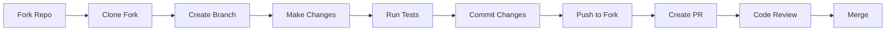

# 🤝 Contributing to Hacktoberfest 2025 Project

First off, thank you for considering contributing to our project! 🎉 It's people like you that make the open source community such a fantastic place to learn, inspire, and create.

## 🎃 Hacktoberfest Guidelines

This repository participates in Hacktoberfest 2025. To ensure your contribution counts:

- ✅ Make sure your PR is against a repository with the `hacktoberfest` topic
- ✅ Your PR should be labeled `hacktoberfest-accepted` by maintainers
- ✅ Your PR must not be spam (low-quality, self-promotional, or disruptive)
- ✅ Your PR should add meaningful value to the project

## 📋 Code of Conduct

This project and everyone participating in it is governed by our [Code of Conduct](CODE_OF_CONDUCT.md). By participating, you are expected to uphold this code.

## 🚀 Getting Started

### Prerequisites

Before you begin, ensure you have:
- Node.js (v18 or higher)
- npm or yarn
- Git
- A GitHub account

### Setting Up Your Development Environment

1. **Fork the repository**
   ```bash
   # Click the Fork button on GitHub
   ```

2. **Clone your fork**
   ```bash
   git clone https://github.com/YOUR_USERNAME/Hacktoberfest-2025.git
   cd Hacktoberfest-2025
   ```

3. **Add upstream remote**
   ```bash
   git remote add upstream https://github.com/ORIGINAL_OWNER/Hacktoberfest-2025.git
   ```

4. **Install dependencies**
   ```bash
   npm install
   ```

5. **Start the development server**
   ```bash
   npm run dev
   ```

## 🎯 How to Contribute

### 1. Find an Issue

Look for issues labeled with:
- `good first issue` - Perfect for newcomers
- `hacktoberfest` - Specifically for Hacktoberfest
- `help wanted` - We need your expertise
- `bug` - Something needs fixing
- `enhancement` - New features or improvements

### 2. Create a Branch

```bash
# Create and switch to a new branch
git checkout -b feature/your-feature-name

# or for bug fixes
git checkout -b fix/bug-description
```

### 3. Make Your Changes

- Write clean, readable code
- Follow our coding standards (see below)
- Add tests for new features
- Update documentation if needed
- Ensure all tests pass

### 4. Commit Your Changes

We use [Conventional Commits](https://www.conventionalcommits.org/) for our commit messages:

```bash
# Examples of good commit messages
git commit -m "feat: add user authentication system"
git commit -m "fix: resolve login button styling issue"
git commit -m "docs: update API documentation"
git commit -m "test: add unit tests for user service"
```

### 5. Push and Create Pull Request

```bash
# Push to your fork
git push origin feature/your-feature-name
```

Then create a Pull Request on GitHub with:
- A clear title describing what you've done
- A detailed description of your changes
- Screenshots (if applicable)
- References to related issues

## 🎨 Coding Standards

### JavaScript/TypeScript

- Use TypeScript for type safety
- Follow ESLint and Prettier configurations
- Use meaningful variable and function names
- Write JSDoc comments for functions
- Prefer const over let, avoid var

```typescript
// ✅ Good
const calculateTotalPrice = (items: Item[]): number => {
  return items.reduce((total, item) => total + item.price, 0);
};

// ❌ Bad
var calc = (arr) => {
  let tot = 0;
  for (let i = 0; i < arr.length; i++) {
    tot += arr[i].price;
  }
  return tot;
};
```

### React Components

- Use functional components with hooks
- Use TypeScript interfaces for props
- Keep components small and focused
- Use proper error boundaries

```tsx
// ✅ Good
interface ButtonProps {
  children: React.ReactNode;
  onClick: () => void;
  variant?: 'primary' | 'secondary';
}

const Button: React.FC<ButtonProps> = ({ 
  children, 
  onClick, 
  variant = 'primary' 
}) => {
  return (
    <button 
      className={`btn btn-${variant}`} 
      onClick={onClick}
    >
      {children}
    </button>
  );
};
```

### CSS/Styling

- Use Tailwind CSS utility classes
- Avoid custom CSS when possible
- Use semantic class names for custom styles
- Ensure responsive design

## 🧪 Testing Guidelines

### Writing Tests

- Write tests for new features
- Aim for at least 80% code coverage
- Use descriptive test names
- Follow AAA pattern (Arrange, Act, Assert)

```typescript
// ✅ Good test
describe('calculateTotalPrice', () => {
  it('should return 0 for empty items array', () => {
    // Arrange
    const items: Item[] = [];
    
    // Act
    const result = calculateTotalPrice(items);
    
    // Assert
    expect(result).toBe(0);
  });
});
```

### Running Tests

```bash
# Run all tests
npm run test

# Run tests in watch mode
npm run test:watch

# Run tests with coverage
npm run test:coverage
```

## 📝 Documentation Guidelines

- Update README.md if you add new features
- Add JSDoc comments to functions
- Update API documentation for backend changes
- Include code examples in documentation

## 🔄 Pull Request Process

1. **Before submitting**, ensure:
   - [ ] All tests pass
   - [ ] Code follows our style guidelines
   - [ ] Documentation is updated
   - [ ] No console.log statements in production code
   - [ ] TypeScript compiles without errors

2. **PR Title Format**:
   ```
   [Type] Brief description of changes
   
   Examples:
   [Feature] Add user profile management
   [Fix] Resolve authentication timeout issue
   [Docs] Update contributing guidelines
   ```

3. **PR Description should include**:
   - What changes were made and why
   - Screenshots (for UI changes)
   - How to test the changes
   - Any breaking changes
   - Related issue numbers

4. **After submission**:
   - Respond to feedback promptly
   - Make requested changes in the same branch
   - Be patient - reviews take time!

## 🏷️ Issue Labels

| Label | Description |
|-------|-------------|
| `good first issue` | Perfect for newcomers |
| `hacktoberfest` | Hacktoberfest-specific issues |
| `help wanted` | We need community help |
| `bug` | Something isn't working |
| `enhancement` | New feature or request |
| `documentation` | Improvements to docs |
| `duplicate` | This issue already exists |
| `invalid` | This doesn't seem right |
| `wontfix` | This won't be worked on |

## 🎖️ Recognition

Contributors will be recognized in:
- README.md contributors section
- Holopin digital badges
- GitHub contributor graph
- Special mentions in releases

## 💡 Need Help?

Don't hesitate to ask for help:

- 💬 **Discussions**: Use GitHub Discussions for general questions
- 🐛 **Issues**: Create an issue for bugs or feature requests
- 📧 **Email**: Contact maintainers directly for sensitive matters

## 🌟 Types of Contributions

We welcome many different types of contributions:

### 🐛 Bug Reports
- Use the bug report template
- Include steps to reproduce
- Provide system information
- Add screenshots if applicable

### ✨ Feature Requests
- Use the feature request template
- Explain the problem you're solving
- Describe your proposed solution
- Consider implementation complexity

### 📚 Documentation
- Fix typos and grammar
- Add missing documentation
- Improve existing explanations
- Translate documentation

### 🧪 Testing
- Add unit tests
- Add integration tests
- Improve test coverage
- Fix flaky tests

### 🎨 Design & UI/UX
- Improve user interface
- Enhance user experience
- Add accessibility features
- Optimize for mobile devices

## 📊 Development Workflow



## 🎉 Thank You!

Thank you for contributing to our project! Your contributions help make this project better for everyone. 

Every contribution, no matter how small, is valued and appreciated. Whether you're fixing a typo, adding a feature, or reporting a bug, you're helping build something awesome! 🚀

---

**Happy Contributing! 🎃**

If you have any questions, don't hesitate to reach out. We're here to help!

[⬆️ Back to Top](#-contributing-to-hacktoberfest-2025-project)